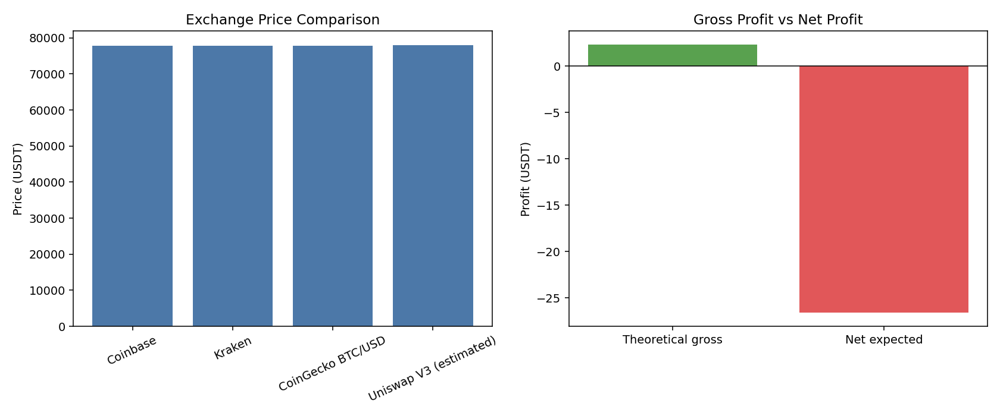

# 🚀 Web3 Arbitrage Reality Analyzer

## 🌐 Live Demo  
👉 https://web3-arbitrage-analyzer.streamlit.app/

> Most arbitrage tools show profit.  
> This tool shows why you **still lose money**.

A Web3-aware arbitrage analyzer that compares centralized exchange (CEX) prices with live decentralized exchange (DEX) liquidity, and determines whether a theoretical arbitrage opportunity actually survives real-world execution.

---

## ⚡ What Makes This Different

Most arbitrage tools only detect **price differences**.

❌ They assume perfect execution  
❌ They ignore real-world costs  

👉 This project models the reality of execution:

- ⏱ Latency (delay)
- 📉 Slippage
- ⛽ On-chain gas fees
- 💸 Trading & transfer costs

💡 **Result: Many “profitable” opportunities are actually NOT executable**

---

## 🧠 Core Features

- 🔗 Live Web3 data from DexScreener (Uniswap / DEX liquidity)
- 🏦 CEX price comparison (Coinbase, Kraken, etc.)
- 📊 Theoretical arbitrage detection
- ⚙️ Execution stress testing (delay + slippage)
- 💰 Full cost breakdown (fees, gas, transfer)
- 🎲 Monte Carlo simulation for execution success probability
- 🚨 Final decision: **EXECUTE / DO NOT EXECUTE**

---

## 📊 What You Get

- Realistic **net profit** after all costs
- Clear **go / no-go decision**
- Execution **confidence level**
- Visual comparison of theoretical vs actual outcomes

---

## 🧪 Example Insight

Even when a price difference exists:

- Theoretical profit: **+$0.65**  
- Total fees: **~$25**  
- Final expected profit: **negative**

👉 **Conclusion: Not realistically executable**

---

## 📸 Demo



---

## 🛠 Tech Stack

- Python
- Streamlit
- DexScreener API (Web3 / DEX data)
- Pandas
- Matplotlib

---

## ▶️ Run Locally

```bash
pip install -r requirements.txt
streamlit run app.py
